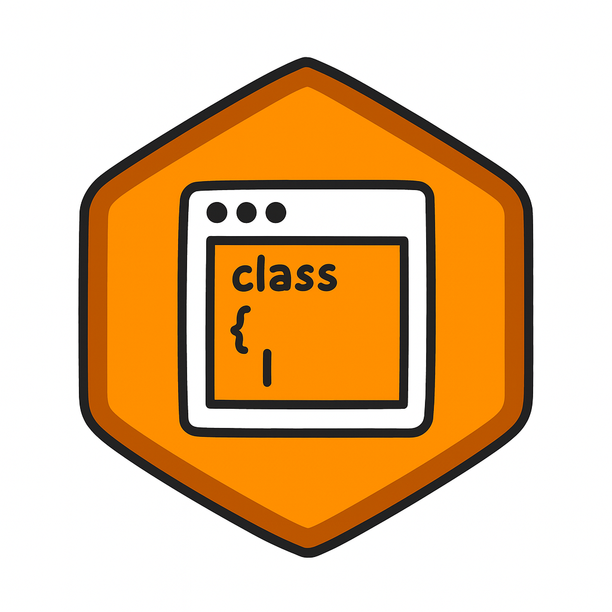
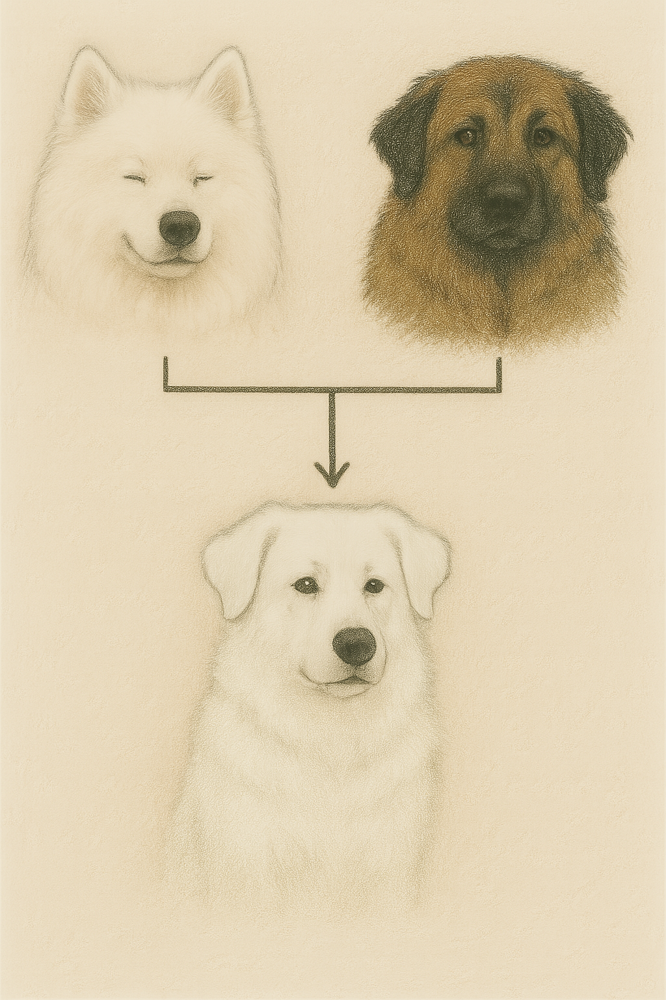

# Overview of classes

{ align=left width="20%" }

## Introduction to classes

Python is an object-oriented programming language. A class in Python serves as a blueprint for creating objects, which are instances of the class. (Image on the left was created with chatGPT.)

Classes enable you to encapsulate data (class attributes) and behaviors (class methods) in a single entity, which make your code modular and easier to manage. Classes allow you to reuse code and avoid repetition, abstract away the implementation details of concepts and objects, and make your code more flexible and adaptable. By building a similar interface in different classes, you can then use each class interchangeably, for example: you might have a class to calculate energy of solids, molecules, or atoms and use such interface to build different calculators, i.e. objects that will use different codes to calculate the energy, such as Octopus for DFT, or Tensorff for a force-field. An example is the [ASE](https://wiki.fysik.dtu.dk/ase/) module for python. 


Another example is feeding an animal. Imagine you have a dog, and you want to feed it, you need to get a certain amount of dog food and put it in is bowl. What if you have a cat instead? It will be different. Still you can make the action of feeding the animal and then do it differently for each animal. In object-oriented programming, you can have this action of feeding the animal as an interface, and then use the feed the cat or dog method as necessary. 


There is a certain hierarchy to programming involving stages of abstraction. Simpler programs, are just top-down scripts. The next level of abstraction takes us to function-driven applications. Creating objects involves a further
stage of abstraction. Object orientation can help to reduce complexity, particularly in long programs. 


## Class definition

You define classes in Python using the class keyword, and instantiate them to create objects, like this

``` py
class Dog():
    ...

my_dog = Dog()
```


Note: In Python, **...** (three dots) is called **Ellipsis**, a built-in object used as a placeholder. It’s useful when code isn’t complete yet, offering a cleaner alternative to pass. Read more [here](https://www.geeksforgeeks.org/what-is-three-dots-or-ellipsis-in-python3/)

Inside the class, you have the body of the class, where you can define the attributes and the methods of the class. It has its own namespace and to access those attributes and methods you need to go through the class or its objects. Let us improve our dog class:
 

``` py
import numpy as np

class Dog:
    def __init__(self, name, age):
        self.name =  name
        self.age = age
        self.color = None
        self.sound = "Waf waf"
        self.position = np.zeros(4)
        
    def walk(self):
        print("Walking on four legs")
        self.position += np.random.randint(0,2,4) + np.array([0,0,0,1])
        
    def bark(self):
        print(self.sound)
        
```

Often, it is easier to understand a concept when you make analogies. So, think yourself of a dog breeder that wants to start breeding dogs. What is a dog? For now, a dog is something that can walk and bark with a characteristic sound, has a name, age, and a color. It also exists somewhere. In other words, our dog class has 5 attributes (**name**, **age**, **color**, **position**, **sound**) and 2 methods (**walk**, **bark**).

Actually, our dog class has one more method: the **\__init__**. The **\__init__** method has a special meaning in Python classes. This method is known as the object initializer because it defines and sets the initial values for the object’s attributes. 

You may have notice that the first argument of the methods was always **self**. It is a convention in python to use self to hold the reference to the current instance (of the object), which allows you to access that instance from within methods.


``` py
import numpy as np

class Dog:
    def __init__(self, name, age):
        self.name =  name
        self.age = age
        self.color = None
        self.sound = "Waf waf"
        self.position = np.zeros(4)
        
    def walk(self):
        print("Walking on four legs")
        self.position += np.random.randint(0,2,4) + np.array([0,0,0,1])
        
    def bark(self):
        print(self.sound)
        
    def get_name(self):
        return self.name

my_dog  = Dog("Gandalf", 3)
other_dog = Dog("Bluey", 3)

print(my_dog.get_name())
print(other_dog.name)
```

The output will be

```
Gandalf
Bluey
```
With every instantiation, you create a new object of the target class. You can access the attributes and methods of an object by using dot notation with the dot operator. You can also easily change the attributes of the instance of the class:

``` py
other_dog.name = "Bingo"
print(other_dog.name)
```
will output

```
Bingo
```

Note about naming conventions: usually, python programmers use **snake_case** for names of methods and functions. While class names usually use **PascalCase**, where each word is capitalized. You can read more about it [here](https://peps.python.org/pep-0008/)

## How to get more information on the contents of a class?


First, you can try to use special python functions. Such as


- **locals**: function returns a dictionary representing the current local symbol table.

- **vars**: function returns the dictionary attribute of an object.

- **dir**: function returns all properties and methods of the specified object, without the values.

Each class or instance also possess a special dictionary **\__dict__**: this attribute holds a dictionary containing the writable members of the underlying class or instance.

Here is an example, try it yourself

``` py
print("\nlocals: ", locals())
print("\ndir Dog: ", dir(Dog))
print("\ndir my_dog: ", dir(my_dog))
print("\nvars: ", vars(my_dog))
print(my_dog.__dict__)
```

Alternatively, check the source. You can always check the content of a class if you search for the .py file where it is written. Here is the one we have been writing. 

``` py
import numpy as np

class Dog:
    def __init__(self, name, age):
        self.name =  name
        self.age = age
        self.color = None
        self.sound = "Waf waf"
        self.position = np.zeros(4)
        
    def walk(self):
        print("Walking on four legs")
        self.position += np.random.randint(0,2,4) + np.array([0,0,0,1])
        
    def bark(self):
        print(self.sound)
    

my_dog  = Dog("Gandalf", 3)


print("\nlocals: ", locals())
print("\ndir Dog: ", dir(Dog))
print("\ndir my_dog: ", dir(my_dog))
print("\nvars: ", vars(my_dog))
print(my_dog.__dict__)
```

If you want to check a file from a package that you installed, you need to look for the site-packages folder on your environment. For example, **numpy** installed in an environment **env** in **ubuntu** is in

```
env/lib/python3.13/site-packages/numpy
```

## Public and private attributes and methods

In python, you do not really have public, private, or protected attributes or methods. However, there is a convention: non_public attributes or methods are named with leading underscores, and these should not be used outside the class. Nothing stops you from doing it, but it is considered bad practice.

Two underscores preceding the name of an attribute or method will trigger name mangling though. Python adds the name of the class preceded by an underscore to it. Here is an example:

``` py
class Dog:
    def __init__(self, name, age):
        self.name =  name
        self.age = age
        self.color = None
        self.sound = "Waf waf"
        self.position = np.zeros(4)
        self.__favorite_food = "chicken"
```
If you now try to print **__favorite_food**: 

``` py
my_dog  = Dog("Gandalf", 3)
print(my_dog.__favorite_food)
```

you get an error:
```
    print(my_dog.__favorite_food)
          ^^^^^^^^^^^^^^^^^^^^^^^
AttributeError: 'Dog' object has no attribute '__favorite_food'. Did you mean: '_Dog__favorite_food'?

```

## Different types of class attributes
There are different types of attributes:

- Class attributes: variables that you define inside the body of the class. Their data is common to the class and all its instances.

- Instance attributes: Variables that you define inside an instance method (methods that have self as first argument). Their data is only available to the current instance and defines its state. Usually they should be defined in **\__init__**.

``` py
import numpy as np

class Dog:
    # class attributes
    owner_name = "Mario"
    number_dogs = 0
    
    def __init__(self, name, age):
        # instance attributes
        self.name =  name
        self.age = age
        self.color = None
        self.sound = "Waf waf"
        self.position = np.zeros(4)
```
Note: If you want to keep track of the number of times your class was used, i.e. keep track of the number of dogs created, you can do something like this:

``` py
import numpy as np

class Dog:
    owner_name = "Mario"
    number_dogs = 0
    
    def __init__(self, name, age):
        self.name =  name
        self.age = age
        self.color = None
        self.sound = "Waf waf"
        self.position = np.zeros(4)
        type(self).number_dogs += 1
        
    def walk(self):
        print("Walking on four legs")
        self.position += np.random.randint(0,2,4) + np.array([0,0,0,1])
        
    def bark(self):
        print(self.sound)
    

my_dog = Dog("Gandalf", 3)
Dog("Rada",1)
Dog("Vada",3)
Dog("Wada",2)
print(Dog.number_dogs)
```

Which will print

```
4
```
What if we want to add attributes to a class or instance dynamically?
We can use **setattr** for that. **setattr**: function in Python that is used to set the value of an attribute of an object. It takes three arguments: the object, the name of the attribute (as a string), and the value to set.  
``` py

class Dog:    
    """ attributes to be added """

info_my_dog = {"name": "Gandalf",
                "age": 3,
                "color":"white"
                }

my_dog = Dog()

for key, val in info_my_dog.items():
    setattr(my_dog, key, val)
    # setattr(Dog, key, val)
    
print(my_dog.name)

```

## Different types of class methods

You can have three different kinds of methods: Instance methods, class methods, and static methods. Let us take a closer look at them:


- Instance methods: Methods to be used by the current instance, these take **self** as first argument. Instance methods should act on instance attributes by either accessing them or changing their values.

Examples are the methods (**walk**, **bark**) shown above.


- Class methods: methods to be used by the class, these take **cls** (another strong convention in Python) as first argument.

As an example, we can make another constructor for the class, (the current constructor is used when we call **Dog()** and takes the same arguments as the **\__init__**):

``` py
import numpy as np

class Dog:
    def __init__(self, name, age):
        self.name =  name
        self.age = age
        self.color = None
        self.sound = "Waf waf"
        self.position = np.zeros(4)
        
    def walk(self):
        print("Walking on four legs")
        self.position += np.random.randint(0,2,4) + np.array([0,0,0,1])
        
    def bark(self):
        print(self.sound)
    
    @classmethod
    def make_dog(cls, sequence):
        return cls(*sequence)
    

# my_dog  = Dog("Gandalf", 3)

my_dog = Dog.make_dog(["Gandalf", 3])
print(my_dog.name)
```
Here we used the decorator **@classmethod**. We can find more about decorators here [python-pep](https://peps.python.org/pep-0318/), [gfg-decorators](https://www.geeksforgeeks.org/decorators-in-python/). Decorators are a powerful and flexible way to modify or extend the behavior of functions or methods, without changing their actual code. A decorator is essentially a function that takes another function as an argument and returns a new function with enhanced functionality. 


We can also use class methods to change class attributes like **owner_name**:


``` py
import numpy as np

class Dog:
    owner_name = "Mario"
    
    def __init__(self, name, age):
        self.name =  name
        self.age = age
        self.color = None
        self.sound = "Waf waf"
        self.position = np.zeros(4)
        
    def walk(self):
        print("Walking on four legs")
        self.position += np.random.randint(0,2,4) + np.array([0,0,0,1])
        
    def bark(self):
        print(self.sound)
    
    @classmethod
    def make_dog(cls, sequence):
        return cls(*sequence)
    
    @classmethod
    def change_owner(cls, name):
        cls.owner_name = name

# my_dog  = Dog("Gandalf", 3)

my_dog = Dog.make_dog(["Gandalf", 3])
print(my_dog.owner_name)
my_dog.change_owner("Vika")
print(my_dog.owner_name)
```

- Static methods: general methods that do not take the current instance or the class. They are included in the body of the class however because they provide important or useful functionality.

Here is an example:

``` py
import numpy as np

class Dog:
    owner_name = "Mario"

    def __init__(self, name, age):
        self.name =  name
        self.age = age
        self.color = None
        self.sound = "Waf waf"
        self.position = np.zeros(4)
        
    def walk(self):
        print("Walking on four legs")
        self.position += np.random.randint(0,2,4) + np.array([0,0,0,1])
        
    def bark(self):
        print(self.sound)
    
    @classmethod
    def make_dog(cls, sequence):
        return cls(*sequence)

    @classmethod
    def change_owner(cls, name):
        cls.owner_name = name

    @staticmethod
    def get_info(name):
        print("Hello {}! This class creates a Dog object that can walk and bark."
              .format(name))

my_dog = Dog.get_name(["Gandalf", 3])
my_dog.get_info("Mario")
```

### Special Methods
Python also has special methods (also known as dunder or magic methods) that have names starting and ending with double underscores, like **\__init__**. These are typically instance methods, and they are essential for python. They are called automatically in response to certain operations.

There are many special methods, some examples are:


- **\__str__** : informal string representation, i.e., returns a string that must represent the object. Can be access with **str()** or **print()** 
- **\__repr__** :  formal string representation, i.e., returns a string that should contain all the information to recreate the object.
- **\__add__** : It defines the behavior of the addition operator + for objects of a class. Can be very useful, for example when creating a matrix class.

You can get more information about these methods here [gfg-dunder](https://www.geeksforgeeks.org/dunder-magic-methods-python/), [pm-dunder](https://www.pythonmorsels.com/every-dunder-method/)

## How to reuse code and make relationships between classes?

Sometimes you want to expand a class, or change a method, or even a few methods from a previous written class. Or you want to organize your code and make it more modular. In object-oriented programming there are several design techniques you can use to do that. Here, we will briefly discuss the major two: inheritance and composition. There are others though, such us dependency injection and delegation.

Following our breeder analogy, now we want to specialize in certain dog breeds. We want our dogs to have characteristics of certain breeds.

### Inheritance  

This design technique, consists of creating hierarchical relationships between classes, where child classes inherit attributes and methods from their parent class. Our dog class will be the child class, and we will use a certain breed of dogs as a parent class.

Let us start by creating a new parent class called Samoyed. Samoyed is a breed of dogs known for two things, working, by pulling sledges, and looking cute.

``` py
import numpy as np
from PIL import Image
import matplotlib.pyplot as plt

class Samoyed:
    def __init__(self):
        self.color = "white"
        self.position = np.zeros(4)

    def work(self):
        print("Pulling a sledge")
        self.position += np.random.randint(0,5,4) + np.array([0,0,0,1])  

    def look_cute(self):
        img = Image.open("gandalf1.jpg")
        img = np.asarray(img)
        plt.imshow(img)
        plt.show()
```

Note: if you found the word **sledge** to be badly placed, you can read about dogsleds [here](https://www.blackfern.coop/Blog-Article-25-sleigh--sled--sledge--bob--toboggan----what-s-the-difference-.html.).

Now, we will give this functionality to our dog class, i.e., we are going to start creating Samoyeds.

``` py
class Dog(Samoyed):
    
    def __init__(self, name, age):
        self.name =  name
        self.age = age
        self.sound = "Waf waf"
        self.color = "black"
        self.position = np.zeros(4)
        super().__init__()
        #Samoyed.__init__(self)

    def walk(self):
        print("Walking on four legs")
        self.position += np.random.randint(0,2,4) + np.array([0,0,0,1])
        
    def bark(self):
        print(self.sound)
    

my_dog = Dog("Gandalf", 3)

my_dog.work()
print(my_dog.position)
my_dog.walk()
print(my_dog.position)
```
The output of this program can be (note that the values are random):

```
Pulling a sledge
[3. 4. 2. 5.]
Walking on four legs
[3. 5. 3. 6.]
```

The **super()** function above allows you to access members in the superclass or parent class. We could have used **Samoyed()** instead, as shown in the comment. Our Dog class inherited the attributes and methods of the **Samoyed** class. Note that we are not using inheritance to create a **Samoyed** class from a general **Dog** class. Here, we are giving the functionality of the **Samoyed** class to our **Dog** class.

What is the color of **my_dog**? Just add

```
print(my_dog.color)
```

to the code above. The output will be:

```
white
```

We first defined the **color** to be "black", but then we used the **\__init__** of the **Samoyed** class which overwrites the color of the instantiated object.

You can use inheritance to provide classes with extra features. Sometimes, these classes are designed with only that in mind. **Mixin** classes are classes that should not be instantiated, they are designed to provide methods to a child class. An example is a class to save data to a **json**:

``` py
import numpy as np
import json

class Save:
    def save_to_json(self):
        return json.dumps(self.__dict__, default=self.default)
    
    @staticmethod
    def default(obj):
        return list(obj)

class Samoyed:
    def __init__(self):
        self.color = "white"
        self.position = np.zeros(4)

    def work(self):
        print("Pulling a sledge")
        self.position += np.random.randint(0,5,4) + np.array([0,0,0,1])        

    def look_cute(self):
        print("{} is looking cute!".format(self.name))
    

class Dog(Save, Samoyed):
    
    def __init__(self, name, age):
        # super().__init__()
        Samoyed.__init__(self)
        self.name =  name
        self.age = age
        self.sound = "Waf waf"
        # self.position = np.zeros(4)

    def walk(self):
        print("Walking on four legs")
        self.position += np.random.randint(0,2,4) + np.array([0,0,0,1])
        
    def bark(self):
        print(self.sound)
    

my_dog = Dog("Gandalf", 3)
my_dog.work()
print(my_dog.position)
print(my_dog.save_to_json())

```

Following our analogy in this example is a bit tricky... We are just adding a method to save the information of our dogs.

Here, we also created the default static method because we got an error, the python array could not be serialized, so we use the **default** method to convert it to a list, which can be serialized. This is also an example of multiple inheritance. Multiple inheritance occurs when a child class takes features from more than one parent.


### Exercise

{ align=left width="100%"}
/// caption 
Image was created with chatGPT.
///

Let us continuing talking about multiple inheritance and define another breed class, **SerraDaEstrela**. This is a Portuguese breed, so it barks in Portuguese and has a different way of looking cute: 

``` py
class SerraDaEstrela:
    def __init__(self):
        self.sound = "Ao ao"
        self.color = "brown"

    def look_cute(self):
        print("{} is looking amazing!".format(self.name))
```

Your task is to make a mix breed **Dog** class. As a breeder, you now want to specialized in creating dogs that are a mix of **Samoyeds** and **Serra da estrela**.


Give both **Samoyed** and **SerraDaEstrela** to the **Dog** class. The new **Dog** class should have the **bark** and **look_cute** methods from **SerraDaEstrela** and the **work** method and **color** attribute from the **Samoyed** class.

Note: Forgot to show you the gandalf1.jpg from the **look_cute** method of the **Samoyed** class. Here it is:

{ align=left width="100%"}

Here is the solution:

``` py
import numpy as np

class SerraDaEstrela:
    def __init__(self):
        self.sound = "Ao ao"
        self.color = "brown"

    def look_cute(self):
        print("{} is looking amazing!".format(self.name))

class Samoyed:
    def __init__(self):
        self.color = "white"
        self.position = np.zeros(4)

    def work(self):
        print("Pulling a sledge")
        self.position += np.random.randint(0,5,4) + np.array([0,0,0,1])        

    def look_cute(self):
        print("{} is looking cute!".format(self.name))
    

class Dog(SerraDaEstrela, Samoyed):
    
    def __init__(self, name, age):
        self.name =  name
        self.age = age
        self.sound = "Waf waf"
        super().__init__()
        Samoyed.__init__(self)
        

    def walk(self):
        print("Walking on four legs")
        self.position += np.random.randint(0,2,4) + np.array([0,0,0,1])
        
    def bark(self):
        print(self.sound)
    

my_dog = Dog("Gandalf", 3)
print(my_dog.color)
my_dog.bark()
my_dog.look_cute()
print(my_dog.__dict__)
my_dog.work()
```

The output is:

```
white
Ao ao
Gandalf is looking amazing!
{'name': 'Gandalf', 'age': 3, 'sound': 'Ao ao', 'color': 'white', 'position': array([0., 0., 0., 0.])}
Pulling a sledge
```

With this exercise you may have realized that problems can arise when a class inherites1``````6532 specific versions of the same method (example: bark method). Python deals with these problems using a specific method resolution order ([MRO](https://docs.python.org/3/howto/mro.html)):

In general, Python searches for methods and attributes in the following order:

  -  The current class
  -  The leftmost superclasses
  -  The superclass listed next, from left to right, up to the last superclass
  -  The superclasses of inherited classes
  -  The object class

So, to successfully used inheritance you need to be careful with the order in which the parent classes appear in the child class. You need to be careful with the **Super()** function, and remember that you can always call specific methods with **ParentClass.method()**. You can use the **\__mro__** or **mro()** to check the mro of a class: 

``` py
print(Dog.__mro__)
print(Dog.mro())
```
gives the output

```
(<class '__main__.Dog'>, <class '__main__.SerraDaEstrela'>, <class '__main__.Samoyed'>, <class 'object'>)
[<class '__main__.Dog'>, <class '__main__.SerraDaEstrela'>, <class '__main__.Samoyed'>, <class 'object'>]
```


### Composition 

You can create complex objects by combining objects that will work as components. Note that these components may not make sense as stand-alone classes.

``` py
import numpy as np
from PIL import Image
import matplotlib.pyplot as plt

class Samoyed:
    def __init__(self):
        self.color = "white"

    def work(self):
        print("Pulling a sledge")
        return np.random.randint(0,5,4) + np.array([0,0,0,1])        

    def look_cute(self):
        img = Image.open("gandalf1.jpg")
        img = np.asarray(img)
        plt.imshow(img)
        plt.show()
    

class Dog:
    owner_name = "Mario"
    
    def __init__(self, name, age):
        self.name =  name
        self.age = age
        self.sound = "Waf waf"
        self.position = np.zeros(4)
        self.breed = Samoyed()
        self.color = self.breed.color
        
    def work(self):
        self.position += self.breed.work()
        
    def walk(self):
        print("Walking on four legs")
        self.position += np.random.randint(0,2,4) + np.array([0,0,0,1])
        
    def bark(self):
        print(self.sound)


my_dog = Dog("Gandalf", 3)
my_dog.work()
my_dog.breed.look_cute()
```

Here, the **Samoyed** class become a component of the **Dog** class, and its methods can now be used inside the Dog class by calling the **breed** attribute, which is actually an instantiation of the **Samoyed** class. We increased the functionality of the **Dog** class, and we do not have any intentions of changing the **Samoyed** class.

### Inheritance vs Composition  

Inheritance establishes a relation between objects, allowing you to use methods and attributes from the parent class to the child class. You can then add extra features. Composition allows you to use a class inside another, as is. 

When one needs to use the class as it without any modification, the composition is recommended and when one needs to change the behavior of the method in another class, then inheritance is recommended. You can read more about it [here](https://www.geeksforgeeks.org/inheritance-and-composition-in-python/).

There are other alternatives to composition and inheritance, such as Dependency injection and Delegation.


### Dependency injection
With this design technique, you can provide an object’s dependencies from the outside, rather than inheriting or implementing them in the object itself. 
``` py
class Dog:
    def __init__(self, name, breed):
        self.name = name
        self.breed = breed

my_dog = Dog("Gandalf", Samoyed())

```

Note: that we provide the breed Class **Samoyed** when we instantiate the object.
 

### Delegation


With this design technique, an object hands a task over to another object, which takes care of executing the task. Imagine you now want to breed cats. In our case, a cat is something very similar to a dog, that meows instead of barking:


{ align=center width="100%"}


Image was created with chatGPT.


``` py
import numpy as np


class Dog:
    owner_name = "Mario"
    
    def __init__(self, name, age):
        self.name =  name
        self.age = age
        self.color = None
        self.sound = "Waf waf"
        self.position = np.zeros(4)
        
    def walk(self):
        print("Walking on four legs")
        self.position += np.random.randint(0,2,4) + np.array([0,0,0,1])
        
    def bark(self):
        print(self.sound)


class Cat:
    def __init__(self, name, age):
        self._dog = Dog(name, age)
        self._dog.sound = "Meow"
        
    def walk(self):
        self._dog.walk()
    
    def meow(self):
        self._dog.bark()
        
    def get_name(self):
        return self._dog.get_name()

my_cat  = Cat("Tom", 3)

print(my_cat.get_name())
my_cat.meow()
my_cat.walk()

```

Here we delegated all the operations related to storing data, walking, retrieving name, and making sounds to the **Dog** object. 

## When to avoid classes


Classes are great and can help you model and solve complex real-world problems. However, be warned. Do not overuse classes! There are many occasions when you should avoid them, such as when you just want to store data, or when you just need to write one single method. In these occasions use a function or other python objects. 

## Further reading

If you want to learn more about classes, you can use any python book, like this [pythonbook](https://books.google.com/books/about/Python_3_for_Absolute_Beginners.html?id=fD1QMt-irpkC&printsec=frontcover#v=onepage&q&f=false), and many resources online, like this [realpython](https://realpython.com/python-classes/). Incidentally, we use these examples to write this overview. 
