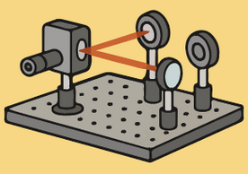

# Overview of devices

## Setup

{ align=left width="20%" }

When you want to measure something in the lab, the first step is to consider the available equipment. Sometimes, you may find that the necessary tools are not available or are too limited for your specific needs. In such cases, you might decide to build your own experimental setup. (Image on the left was created with chatGPT.)

In the field of photonics, there is a wide array of equipment and components that can be used to construct custom setups:

- lasers, 
- beam splitters, 
- optical fibers, 
- mirrors, 
- lenses, 
- waveplates, 
- modulators, 
- photodetectors,
- spectrometers,
- stages,
- filters, 
- and other optical elements—mounts. 

These components can be combined in flexible ways to perform measurements such as transmission, reflection, absorption, photoluminescence, nonlinear optical effects, et cetera.

Many companies specialize in manufacturing optical components and laboratory equipment. Examples of such companies are

- Zurich Instruments,
- Thorlabs, 
- Newport (MKS Instruments), 
- Edmund Optics, 
- PI (Physik Instrumente).

A growing number of these devices come with motorized or electronic control, and manufacturers often provide their own proprietary software as well as application programming interfaces (APIs), software development kits (SDKs), or Python libraries. This enables users to write custom scripts to automate alignment, control tunable optics, acquire data, and perform real-time adjustments—making it possible to fully integrate hardware control into experimental workflows.

Designing your own setup allows you to tailor the experiment precisely to your goals, whether it's maximizing sensitivity, optimizing spatial resolution, or synchronizing multiple light sources and detectors. It also deepens your understanding of the underlying physics and the tools themselves, which is an essential skill in experimental photonics.

## How does the device work?

Before building your setup, you need to understand a few things though. Most importantly, how does the device work? How does a linear stage move back and forth? What are the constraints and the error on the measures or movement of a device? Luckily, most of the questions that might come to your mind will have an answer written on the manual of the device provided by the company (that you bought the device from). So our advice would be to always read these manuals.

## Company software
If the device can be connected to a computer, the company that sold you the device will also provide software to use the device. Our second piece of advice is to always check it out. Without a doubt you should install it: the software will give show you directly the capabilities and constraints of the devise, and will often come with libraries, such as DLL's (Dynamic Link Library) that your computer might need to even connect or use the device. 

## How to connect with python?

You might also want to control to the device using python (or any other programming language, though python is probably the easiest). Since this may give you more control over the flow of the experiment, over the saving and processing of the experimental data, and can also give you all the tools necessary to automate the experiment.

To control a device with python, you will need a python package that implements the methods necessary to find the device, connect to the device, and perform the task of device, such as moving back and forwards for a linear stage or measuring a quantity for a detector. You can always write it yourself, although this might be complicated and time-consuming. Luckily, specially when working with python, there is a good change that someone else already wrote it. So, your first task is to find these packages. And then you can alter them or use as is. 

Note: Often, the packages you might write or find online will not have all the functionality provided by the company software, as these packages are not official packages. It will have methods to do the main task of the device (like moving back and forth on a linear stage) but it might lack functionality, like printing information of the device or cleaning the device. So, once again we advise you not to neglect the software provided by the company.

### PySerial and PyVISA

In order to control a device with a computer, there are many protocols, sent over many interfaces and bus systems, such as GPIB, RS-232, VXI, USB, Ethernet.

A [serial port](https://en.wikipedia.org/wiki/Serial_port) is a serial communication interface through which information transfers in or out sequentially one bit at a time. Early personal computer used a serial port to communicate with devices, such as modems, terminals, and peripherals. Nowadays, serial ports have been replaced with more efficient interfaces, such as USB and the term serial port usually denotes hardware compliant with [RS-232](https://en.wikipedia.org/wiki/RS-232) serial communication standard.

Modern devices use an integrated circuit called a Universal_asynchronous_receiver-transmitter [UART](https://en.wikipedia.org/wiki/Universal_asynchronous_receiver-transmitter) to implement a serial port, though. This integrated circuit converts characters to and from asynchronous serial form, implementing the timing and framing of data specified by the serial protocol in hardware.

[PySerial](https://pyserial.readthedocs.io/en/latest/pyserial.html#overview) is a python module that encapsulates the access for the serial port. With it, the python program in your computer can communicate with a device.

What about the other interfaces? Whether you are using RS-232, GPIB, Ethernet, VXI, or USB, message-based communication is a standard protocol for controlling and receiving data from instruments. Because most message-based devices have similar capabilities, it is natural that the driver interface should be consistent. The Virtual instrument software architecture [VISA](https://en.wikipedia.org/wiki/Virtual_instrument_software_architecture) is a widely used application programming interface in the test and measurement industry for communicating with instruments from a computer. VISA is a standard for configuring, programming, and troubleshooting instrumentation systems.

[PyVISA](https://pyvisa.readthedocs.io/en/latest/) is both a Python wrapper for VISA shared libraries but can also serve as a front-end for other VISA implementation. In order for PyVISA to work, you need to have a suitable backend. PyVISA includes a backend that wraps the National Instruments’s VISA library. If you want to use PyVISA you need to install [National Instruments’s VISA library](https://www.ni.com/en/support/downloads/drivers/download.ni-visa.html#565016) or [PyVISA-Py](https://pyvisa.readthedocs.io/projects/pyvisa-py/en/latest/) which is a pure Python implementation of the VISA standard. 

### Exercise

Find the manuals for the two devices we will use after the break:

- Thorlabs ELL17 linear stage
- Thorlabs PM100D power meter