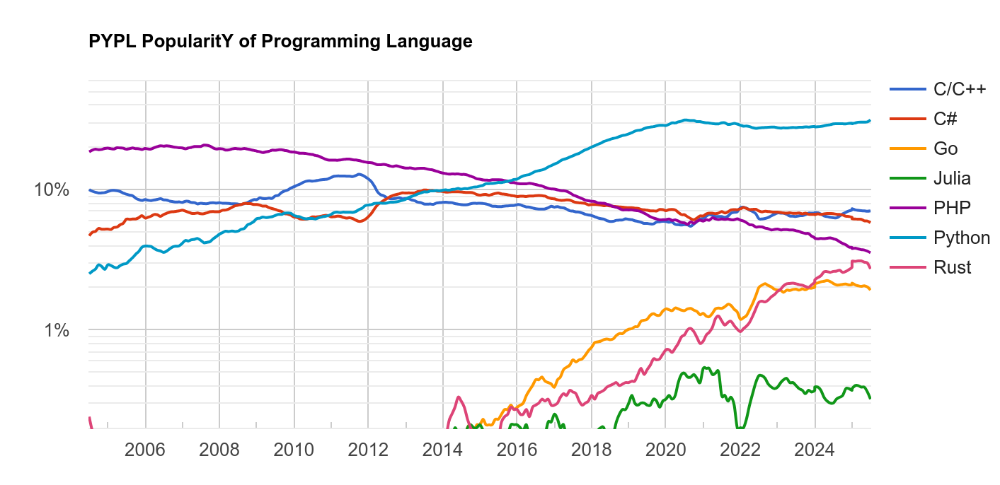

# Welcome to the photonics automation python school

{ align=left width="15%" }

## Introduction to python

First, we have a couple questions for you, why is this programming language called python?
(Image on the left was created with chatGPT.)

{ align=left width="100%" }
/// caption
https://thenewstack.io/what-is-python/
/// 
Is it because of snakes or 

{ align=right width="100%" }
/// caption
https://www.imdb.com/title/tt0063929/
/// 
comedy?


{ align=left width="50%"} 

And who is this guy?

Guido van [Rossum](https://en.m.wikipedia.org/wiki/File:Guido_van_Rossum_in_PyConUS24.jpg) started designing python on the Christmas season of 1989. Python was then released in 1991. Guido needed a short recognizable name for his programming language. Python came to his mind because, at the same time he was developping the language, he was also reading scripts from "Monty python flying circus".  

## What is python?


Python is an object-oriented, usually interpreted, general-purpose programming language with dynamic semantics. Its high-level built in data structures, combined with strong dynamic (duck) typing and dynamic binding, make it very attractive for rapid application development. It also supports other programming paradigms, such as procedural and functional programming. 

Python combines remarkable power with very clear syntax, it incorporates modules, exceptions, and is very easy to debug. 


Python is portable, open source, and usable as an extension language for applications that need a programmable interface and as a scripting language to connect existing components together.


You can read more here [python:faq](https://docs.python.org/3/faq/general.html) and [python:essays](https://www.python.org/doc/essays/blurb/).


## Different implementations of python


When people talk about python, usually they are refering to the Cpython implementation (see [source](https://github.com/python/cpython)), managed by the non-profit organization Python Software Foundation, which develops and maintains Python standards.

But there are other implementations, such as IronPython (written in .NET), Jython (in Java), PyPy (implementation with JIT compiler). 


## Who uses python?

"In 2025, Python continues to be a popular choice for a wide range of organizations and applications, including tech giants like Google, Netflix, and Facebook, as well as companies in fields like data science, web development, and AI/ML. Its versatility and ease of use make it a valuable tool for various tasks, from building web applications to analyzing data and developing AI models." by Google AI overview

 Python is actually the most popular choice for programming language, see [PYPL](https://pypl.github.io/PYPL.html) PopularitY of Programming Language, and [TIOBE](https://www.tiobe.com/tiobe-index/) index.

{ align=left width="100%"}

{ align=left width="100%"}
/// caption
https://medium.com/nerd-for-tech/top-10-python-development-company-to-hire-d83507a33755
/// 

Python has become a prominent programming language in academia, especially in STEM fields, due to its versatility, ease of use, and extensive libraries for data analysis, machine learning, and other research areas. It's increasingly used for teaching programming in various disciplines, from introductory courses to advanced research projects. A few examples of widely used python libraries are NumPy, Pandas, Scikit-learn, TensorFlow, and PyTorch. 


## How to use python?

Here we will go over some python basics. 

### Hello World

It all starts with a hello!

``` py
print("Hello World!")
```

### Loop

To move from A to B with a certain integer stepsize:

``` py
A = 0
B = 20
stepsize = 2 
for pos in range(A, B+1, stepsize):
    print(pos)
```

### Write to a file

To write "wavelength" and "intensity" to a file use
``` py
with open("data.txt", "w") as f:
    f.write("wavelength intensity")
```
or you can also use the print function
``` py
with open("data.txt", "w") as f:
    print("wavelength intensity", file=f)
```

### Read from a file

To read from a file use
``` py
with open("data.txt", "r") as f:
    data = f.readlines()
```

### Modules
To use python libraries, packages, or modules in your code, write

``` py
import glob
import numpy as np
import matplotlib.pyplot as plt
from time import time
```

### Writing and reading using numpy

To write a .txt file, use numpy.savetxt

``` py
import numpy as np

n = 20
x = list(range(0,n))
y = list(range(0,n*2,2))

np.savetxt('out.txt', np.c_[x,y], fmt='%1.3f', header="n = {}\nx y".format(n))
```
to read numpy.loadtxt and readline for the header
``` py
import numpy as np

data = np.loadtxt("out.txt")
print(data)

#Missing header
with open("out.txt", "r") as f:
    header = f.readline()
    header += f.readline()

print(header)
```

You can use numpy to write to different file types, such as .npz. NPZ is a file format by numpy that provides storage of array data using gzip compression

To write simply use numpy.savez
``` py
import numpy as np

n = 20
x = list(range(0,n))
y = list(range(0,n*2,2))

np.savez("out", x=x, y=y, n=n)
```

To read we can use numpy.load. Data is some complex data type, but it can be read similarly to a dictionary

``` py
import numpy as np

data = np.load("out.npz")
for key, val in data.items():
    print(key, val)
print(data["n"])
```

### Writing and reading using json

To write we open a .json file and write a dictionary to it
``` py
import json

n = 20
x = list(range(0,n))
y = list(range(0,n*2,2))

with open("out.json", "w") as f:
    json.dump({"x":x, "y":y, "n":n}, f)
```

To read use
``` py
import json

with open("out.json", "r") as f:
    data = json.load(f)
    
print(data)
```

### Plotting

Here is a simple example on how to plot with matplotlib:

``` py
import numpy as np
import matplotlib.pyplot as plt

x = np.linspace(0, np.pi, 100)

plt.plot(x, np.sin(x))
plt.show()
```

### Functions

Here is a simple example on how to use functions:

``` py
def say_hello(name):
    x = "Hello {}!".format(name)
    print(x)
    return x

w = say_hello("Mario")
print(say_hello("Gandalf"))

```

### Python dictionary

Here is a simple example on how to use python dictionaries:

```py
data = {"positions":[0,5,10,15,20],
        "measurement":[1,2,3,4,5],
        "step":5
        }
print(data)
print(data.items())
print(data.keys())
print(data.values())

for key, value in data.items():
    print(key, value) 
```