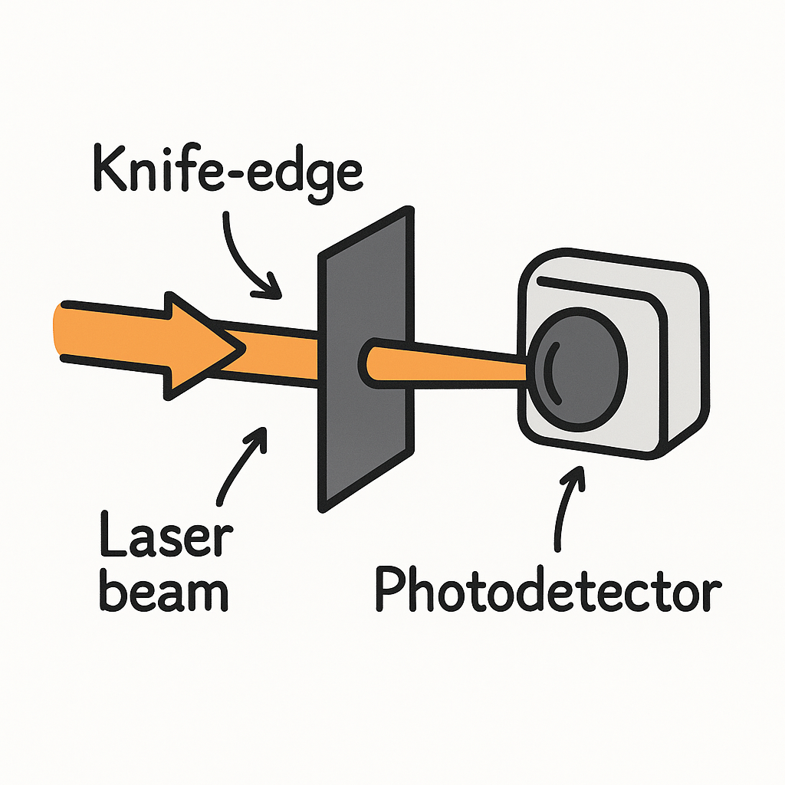
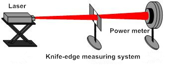

# Knife-edge experiment

{ align=left width="20%" }

## History

The [Foucault knife-edge](https://en.wikipedia.org/wiki/Foucault_knife-edge_test) test was described in 1858 by French physicist Léon Foucault as a way to measure conic shapes of optical mirrors. It measures mirror surface dimensions by reflecting light into a knife edge at or near the mirror's center of curvature. (Image on the left was created with chatGPT.)

The Foucault knife-edge test, originally designed for testing mirror curvature, can be adapted to measure the diameter of a laser beam. 

## Measuring the diameter of a laser beam.

{ align=left width="100%" }
/// caption
https://www.cnilaser.com/Laser-Gaussian-Beam-Measurement.htm
///

A simple method to determine the diameter of a laser beam is to gradually eclipse the laser beam using a sharp knife-edge. As the knife-edge intersects the beam in a direction perpendicular to the propagation axis of the beam, a photodetector measures the intensity of the unmasked portion of the beam. If the spatial profile of the laser beam is described by a Gaussian line shape, the signal measured by the detector is represented by an integrated Gaussian function. In principle, the beam diameter can be determined from such photodetector data. One approach involves electronic or numerical differentiation of the experimental data, thus reconstructing the original Gaussian profile. See [this](https://opg.optica.org/ao/abstract.cfm?uri=ao-22-21-3406) for more information. See [this](https://www.sciencedirect.com/science/article/pii/S1350449514001030) on for non-Gaussian beams.

Here, we are going to perform a knife-edge scan, using the modules we have written so far, and a linear stage and a power meter devices. Below you can see all the modules we discussed previously.

## Python Module for the linear stage

The complete module discussed in Linear Stage

``` py
import elliptec
import sys, os
import time
import save_data

class LinearStage():
    """ Linear stage interface"""

    def __init__(self):
        self.ports = None
        self.devices = None
        self._controller = None
        self.device = None
        self.current_position = None


    def find_devices(self):
        """ Lists serial port names """

        ports = elliptec.scan.find_ports()
        self.ports = ports[:]    
        return ports

    def connect(self, idn):
        self._controller = elliptec.Controller(idn, debug=False)
        self._controller.port = idn
        self.devices = elliptec.scan_for_devices(controller=self._controller)
        self.device = elliptec.Linear(self._controller)
        self.current_position = self.check_position()
        return self.device.info
    

    def home(self):
        sys.stdout = open(os.devnull, 'w')
        self.device.home()
        sys.stdout = sys.__stdout__


    def move(self, pos):
        sys.stdout = open(os.devnull, 'w')
        position = self.device.set_distance(pos)
        sys.stdout = sys.__stdout__
        self.current_position = position
        return position


    def check_position(self):
        return self.device.get_distance()


    def jog_and_measure(self, start=0, end=60, step=1, function=None, time_wait=1):

        if not function:
            print("Need funcion")
            return 1

        position, measure = [], []
        for pos in range(start, end+1, step):
            position.append(self.move(pos))
            measure.append(function())
            time.sleep(time_wait)

        save_data.with_print(position=position, measure=measure, parameters={"step":step})
        return 0


if __name__ == "__main__":

    ls = LinearStage()
    lls = ls.find_devices()
    info = ls.connect(lls[0])
    print(info)

    ls.home()
    ls.jog_and_measure(step = 5, function=time.time, time_wait=0)
    ls.move(14)
```

## Python Module for the power meter

The complete module discussed in power meter:

``` py
import pyvisa
from ThorlabsPM100 import ThorlabsPM100
import numpy as np

# import warnings
# warnings.filterwarnings('ignore')
# pip install zeroconf psutil

class PowerMeter():

    def __init__(self):
        """
        A general powermeter interface.
        """

        # self.rm = pyvisa.ResourceManager('@py')
        self.rm = pyvisa.ResourceManager()
        self.powermeters = {}
        self.inst = None
        self.powermeter = None
        self.lastAcq = None
        self.trace = np.zeros(100)
        self.parameters = {"wavelength": None,
                           "background": 0,
                           "unit": None}

        self._str_wavelength = 'sense:corr:wav'
        self._str_power = 'power:dc:unit '

    def find_powermeter(self):
        """Find all available ports with Power Meter: PM100 attached."""
        for addr in self.rm.list_resources():
            try:
                name = self.rm.open_resource(addr).query('*IDN?')
                if 'PM100' in name:
                    self.powermeters[name] = addr
            except:
                pass
        return list(self.powermeters.keys())

    def connect(self, idn):
        """ Connects to the power meter attached to port idn 
            idn example: list(self.powermeters.keys())[0] 
        """
        self.inst = self.rm.open_resource(self.powermeters[idn])
        self.inst.read_termination = '\n'
        self.inst.write_termination = '\r\n'
        self.powermeter = ThorlabsPM100(inst=self.inst)
        self.powermeter.configure.scalar.power()
        self.lastAcq = self.powermeter.read

        self.get_wavelength()
        self.get_unit()

        print('Connected to powermeter: {}'.format(idn))

    def read(self, pure=False, printval=False):
        """ Make measurement: in this case, read power, if 
            pure is False, subtracts the background to the measurement
        
        """
        if pure:
            val = self.powermeter.read
        else:
            val = self.powermeter.read - self.parameters["background"]
        self.lastAcq = val
        self.trace = np.append(self.trace[1:], val)
        if printval:
            print('Measure: {} {}'.format(val, self.parameters["unit"]))
        return val

    def get_background(self):
        """ Make a background measurement """
        self.parameters["background"] = self.read(pure=True)
        self.read()
        print('Background: {} {}'.format(self.parameters["background"], self.parameters["unit"]))

    def get_wavelength(self):
        """ Get current wavelength used by the power meter""" 
        wl = self.inst.query(self._str_wavelength+'?')
        self.parameters["wavelength"] = wl
        print('Wavelength: {} {}'.format(wl, "nm"))
        return wl

    def set_wavelength(self, wl):
        """ Change wavelength used by the powermeter to calculate the power"""
        self.inst.write(self._str_wavelength+' '+str(int(wl)))
        return self.get_wavelength()

    def get_unit(self):
        """ Get current unit used by the power meter""" 
        u = self.powermeter.sense.power.dc.unit
        self.parameters["unit"] = u     
        return u 

    def set_unit(self, unit):
        """ Set units of the power meter, allowed units: W or dBm"""
        if unit not in ['W', 'dBm']:
            print("Unit must be W or dBm")
        else:
            self.inst.write(self._str_power+unit)
        return self.get_unit()

    def switch_unit(self):
        """ Switch units of powermeter between dBm and W"""
        if self.parameters["unit"] == 'W':
            self.inst.write(self._str_power+'dBm')
        else:
            self.inst.write(self._str_power+'W')
        return self.get_unit()   

if __name__ == "__main__":    
    #initialize class             
    pm = PowerMeter()

    #Find powermeters and connect to first one
    lpm = pm.find_powermeter()
    
    print(lpm)
    pm.connect(lpm[0])


    #Measure, get background and measure again
    pm.read(printval=True)
    pm.get_background()
    pm.read(printval=True)

    pm.get_wavelength()

    pm.switch_unit()
    pm.read(printval=True)
    pm.switch_unit()
    pm.read(printval=True)
```

## Save_data module

The complete module discussed in save data

``` py
def with_print(parameters={}, **kwargs):
    """ Print parameters and measurements into a file, slightly organized"""
    for key, val in parameters.items():
        print("#", "%s: %s" % (key, val))
    print("#", *kwargs.keys())
    for row in zip(*kwargs.values()):
        print(*row)
    
def with_print_dump(**kwargs):
    """ Print data, not organized """
    print(kwargs)

def with_print_fancy(**kwargs):
    """ print data after separating lists of measurements from parameters"""

    print_as_list = []
    for key, val in kwargs.items():
        if not isinstance(val, list):
            print("#", "%s: %s" % (key, val))
        else:
            print_as_list.append(key)
                
    print("#", *print_as_list)
    for row in zip(*(kwargs[i] for i in print_as_list)):
        print(*row) 

  
def to_file(filename = "out", parameters={}, **kwargs):
    """ save data into a .txt file, it is basically function:with_print but we redirect the output to the file""" 
    filename = filename + ".txt"
    with open(filename, "w") as f:
        for key, val in parameters.items():
            print("#", "%s: %s" % (key, val), file=f)
        print("#", *kwargs.keys(), file=f)
        for row in zip(*kwargs.values()):
            print(*row, file=f)
            
def with_json(filename = "out", **kwargs):
    """ write data into a json file"""
    import json
    
    filename = filename + ".json"
    
    with open(filename, "w") as f:
        json.dump(kwargs, f)
     
def with_numpy(filename = "out", parameters={}, **kwargs):
    """ Write data to a .txt file with numpy""" 
    import numpy as np
    
    filename = filename + ".txt"
    header = ""
    for key, val in parameters.items():
        header += "{}: {} \n".format(key, val)
    header += " ".join(kwargs.keys())
    
    np.savetxt(filename, np.c_[ *kwargs.values() ], header=header)
```    

## Plot module

The complete program discussed in plot data:

``` py
import json
import glob
import numpy as np
import matplotlib.pyplot as plt

# find the file containig the data
filenames = glob.glob("out*json")
print(filenames)

# open the file and get the data
with open(filenames[-1], "r") as f:
    data = json.load(f)

# check what is in the file
print(data.keys())

# treat the data if necessary
y = np.array(data["measurements"])
y *= 1000 # scale to change units, plot looks better

# factor = y[0]           # remove background if necessary
# y = (y - factor)*1000

# make a nice plot for the data
plt.rcParams.update({'font.size': 15})
fig, ax = plt.subplots(figsize=(8,8))
ax.plot(data["positions"], y, label="Step = {} mm".format(data["parameters"]["step"]))
ax.legend()
ax.set_xlabel("Position (mm)")
ax.set_ylabel("Power (mW)")
ax.tick_params(axis='both', direction='in', top=True, right=True)

# show the plot or save it into a file
#plt.show()
plt.savefig("my_plot_{}.png".format(data["parameters"]["step"]))
```

## Exercise

Use the modules or programs above and write a knife_edge experiment class with python.

{ align=center width="100%"}


Here is the solution:

``` py
import my_powermeter as mpm
import my_linear as mls
import time
import datetime
import save_data

class KnifeEdge:

    """ Class to perform knife-edge experiment """

    def __init__(self):
        self.powermeter = mpm.PowerMeter()
        self.linear_stage = mls.LinearStage()
        self.parameters = {            # parameters from the linear stage
            "start": 0,
            "end":   60,
            "step":  1, 
            "sleep": 0.5 
        }
        self.positions = []
        self.measurements = []

        # First we need to find the devices
        lpm = self.powermeter.find_powermeter()
        lls = self.linear_stage.find_devices()

        
        # Second, attempt to connect to the devices
        try:
            self.powermeter.connect(lpm[0])
        except:
            print("Could not connect to powermeter")
            print(lpm)
            return 

        try:
            self.linear_stage.connect(lls[0])
        except:
            print("Could not connect to linear stage")
            print(lls)
            return


    def initialize(self):
        """ Home the linear stage and measure the backgroung of the powermeter """
        self.linear_stage.home()
        self.powermeter.get_background()

    def get_parameters(self):
        """ Obtain parameters from the linear stage and from the powermeter """
        for key, val in self.parameters.items():
            print("%s: %s" % (key, val))
        for key, val in self.powermeter.parameters.items():
            print("%s: %s" % (key, val))
        return self.parameters, self.powermeter.parameters

    def set_parameters(self, start=0, end=60, step=1, sleep=0, 
                      pm_unit='W', pm_wl=400):
        """ Function to change the experiment parametes """
        self.parameters["start"] = start
        self.parameters["end"] = end
        self.parameters["step"] = step
        self.parameters["sleep"] = sleep

        self.powermeter.set_wavelength(pm_wl)
        self.powermeter.set_unit(pm_unit)
        return self.get_parameters()

    def run(self):
        """ Function to run the experiment itself, creates a file with parametes and the measured values """

        # first get a file name with the current date and time
        filename = "out_"+str(datetime.datetime.now()).replace('.','_').replace(' ', '_').replace(':', '_')

        # loop over the possible positions of the linear stage
        for pos in range(self.parameters["start"], 
                         self.parameters["end"], self.parameters["step"]):

            # move the stage and store position
            self.positions.append(self.linear_stage.move(pos))
            # measure the power
            self.measurements.append(self.powermeter.read()) 
            # wait for a bit, just in case
            time.sleep(self.parameters["sleep"])

            # save parametes and measurements to file at every iteration, in case there is a crash interruption
            save_data.with_json(filename=filename,
                                parameters=self.parameters, 
                                pm_parameters=self.powermeter.parameters, 
                                positions=self.positions, 
                                measurements=self.measurements)       


exp = KnifeEdge()
# exp.initialize()
# exp.set_parameters()

exp.get_parameters()
exp.run()
print(exp.__dict__)
```