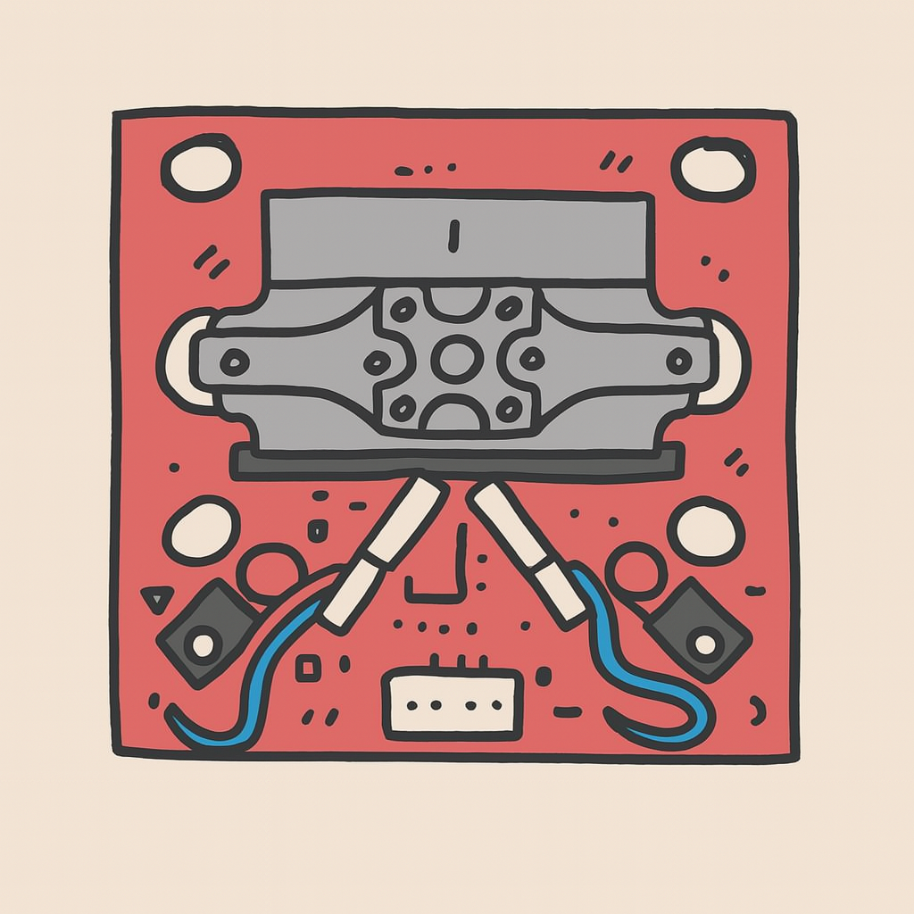
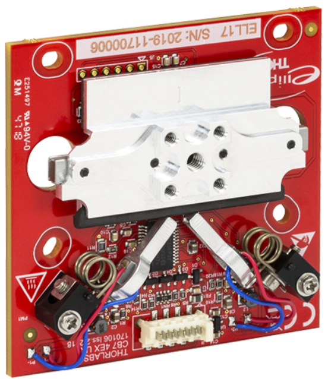
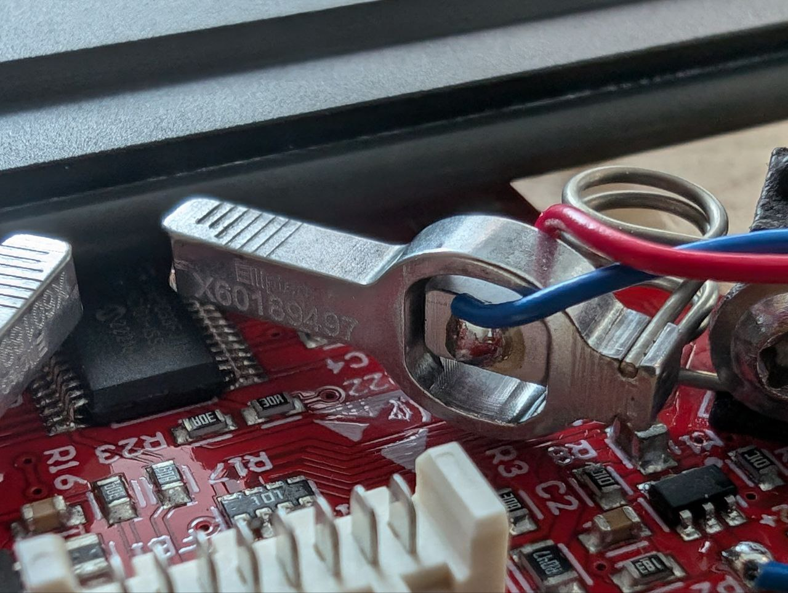
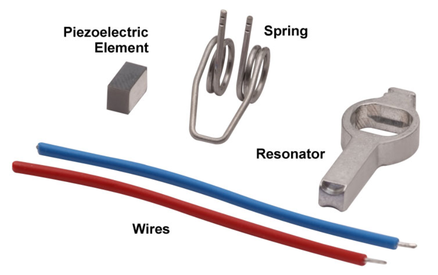
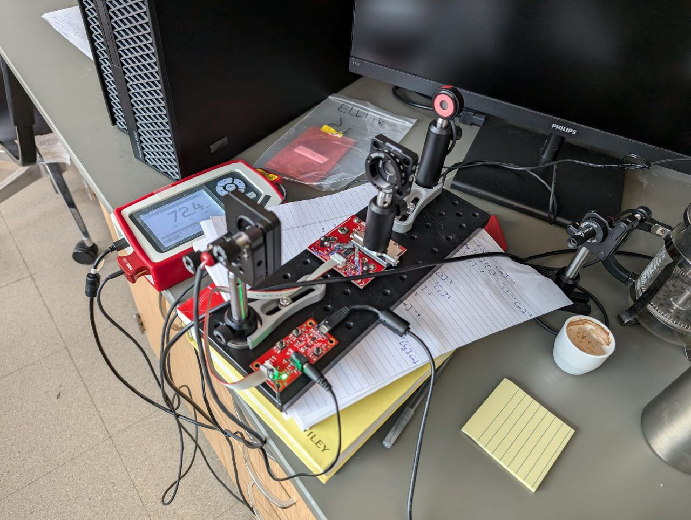
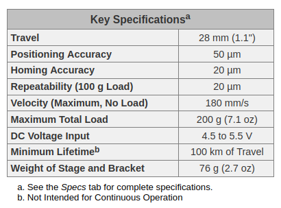
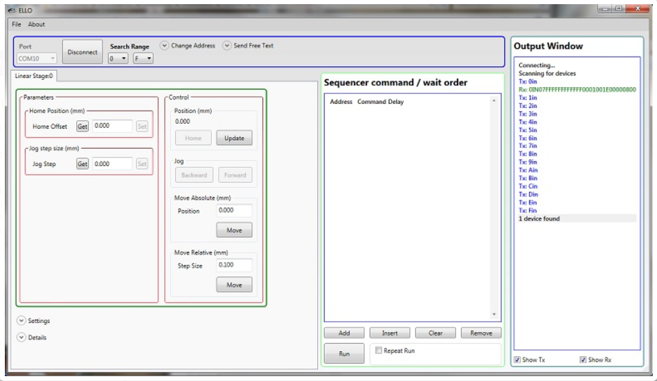
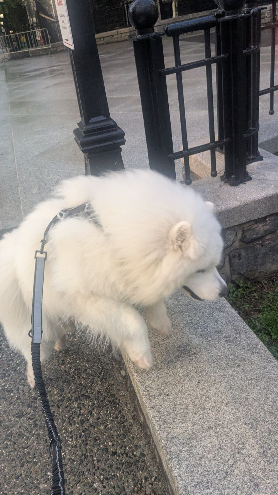

# Linear stages

{ align=left width="20%" }

## Overview

A linear stage is a component of a precise motion system used to restrict an object to a single axis of motion. 
(Image on left the as created with chatGPT.)

There are several linear stages you can use in your experiments: they have different designs and are suitable for different travel ranges. Here, we will take a look at the Thorlabs: [ELL17](https://www.thorlabs.com/thorproduct.cfm?partnumber=ELL17#ad-image-0) linear stage.

## Thorlabs: ELL17

This component uses [piezoelectric motors](https://en.wikipedia.org/wiki/Piezoelectric_motor) to move the actual stage in a range of **48 mm**, with a position accuracy of 50 μm. Here, is a picture:

{ align=left width="100%" }

You can clearly see the linear stage attached to a circuit board, some screw slots, and the piezo motors. This last one might have confused you a bit, so let us take a look at the motor 

{ align=left width="100%" }
and its parts
{ align=left width="100%" }
/// caption
https://www.thorlabs.com/newgrouppage9.cfm?objectgroup_id=10461&pn=ELL17
///

### How does it work?

The main principle behind these kinds of motors, is that when an electric field is applied to a piezoelectric material, the material will change shape. The word **piezo** is derived from the Greek word for pressure. The motion of the linear stage is then controlled by forcing the piezoelectric elements to vibrate at specific ultrasonic frequencies.

The motor is operated by driving it at one of its two resonance frequencies. A voltage signal oscillating at an ultrasonic frequency is applied to the piezoelectric chip, which responds by expanding less than a micron and then contracting back to its original dimensions at the frequency of the driving signal. This continuous change of the chip's volume causes a vibration in the aluminum resonator housing. When the vibration is at one of the resonator's resonance frequencies, a pushing motion results at the tip of the motor. When the vibration is at the other resonance frequency a pulling motion is observed.


So, for each motor, there is an ultrasonic resonant frequency that will push the stage forward, and another that will pull the stage backward. Operating a motor at one of its resonance frequencies causes the tip of the motor to continuously cycle in a tight clockwise elliptical path. When the motor is driven at its other resonant frequency, the tip of the motor cycles through that same path in a counterclockwise direction. Both resonant frequencies are around 100 kHz. The total displacement at the tip of motor is a function of the mechanical load it is driving, and the voltage supplied to the piezo element. In the case of no loading and a 5 V maximum driving voltage at a resonant frequency, the tip of the motor expands and contracts by a few microns while tracing the elliptical path.

The purpose of the spring is to maintain constant contact between the tip of the resonator and the driven item

To complement this explanation, take a look at this [video](https://www.youtube.com/watch?v=0fyJMg4gUJo)

An interface board can be used to supply power to the linear stage and to move the stage forward and backward in increments (2 mm default). The interface board can also be used to connect the linear stage to a computer.


Note on the resonant frequencies: It is important to search for the optimal resonant frequencies, this can be done at any time and should be done after changes in loading or ambient temperature.


Finally, here is a picture that shows and example of a setup that includes this linear stage and the interface board:

{ align=left width="100%" }

### Company software and manual

In this day and age, it is customary for the selling companies to provide not only a user manual, but also software that you can use in your computer to control the device. Thorlabs provides not only the Elliptec System Software, but also the Communications Protocol manual, which details the communication commands for the Elliptec software package. As discussed previously, you should always read and inspect these manuals and software. They will provide you with helpful information, such as 

- Capabilities and constrains of the device, 
{ align=left width="100%" }
- Safety and environmental limits (example: Maximum altitude of 2000 m),
- Cleaning and usage details (example: Position Error Compensation).

Here is a print screen to show you what the software for the linear stage looks like:

{ align=left width="100%" }

"Commands are entered in the Sequencer command / wait order section located at the center-left of the GUI. An example of a sequence of commands that might be sent to the device is **Agj** to get the jog step size of the stage at address **A**, **Asj0000200** to set the jog step size as 0.25 mm, and **Abw** to jog the stage at address **A** backward by 0.25 mm. The command **As1** is used to perform the frequency search that will identify the optimal resonant frequencies, for the current operating conditions, for Motor 1 at address **A.**" Protocol data is sent in ASCII HEX format, while module addresses and commands are mnemonic character (no package length is sent). Modules are addressable (default address is “0”) and addresses can be changed and saved using a set of commands. Lower case commands are sent by user while upper case commands are replies by the module. (Taken from the device page in the Thorlabs website provided above.)

### How to connect with python?

One of the beauties of python, is that when you need a particular piece of code to perform a certain task, there is a good chance that someone already did it and distributed it online. In this case we want to find a python package to control this ELL17 linear stage. A quick google search will show you the [elliptec](https://github.com/roesel/elliptec) python package. We will use it to control the ELL17 with our computers, and the package will take care of the communication with the device, so that we do not have to write any ASCII HEX messages ourselves.

Keep in mind that there are 3 important methods we must implement: 

- Find the device.
- Connect to the device.
- Perform the task. In this case, move back and forwards


#### Find the device

For this we will use Pyserial to find the port to which the linear stage is connected

``` py
import serial.tools.list_ports as listports
listports.comports()
```
This will list you all possible ports. You can limit the search to look for devices connected with USB or with a UART protocol using conditions:

``` py
import serial as s
import serial.tools.list_ports as listports

def find_linear_stage():
    """ Lists serial port names """

    ports = []
    possible_ports = listports.comports()
    for p in possible_ports:
        if "UART" in p.description or "USB" in p.description:
            ports.append(p.device)
    return ports
```

Or you can look for serial_number and attempt to make a connection, this is what the elliptec package does:

``` py
import serial as s
import serial.tools.list_ports as listports

def find_ports():
    """Find all available ports with an Elliptec device connected."""
    avail_ports = []
    for port in listports.comports():
        if port.serial_number:
            try:
                connection = s.Serial(port.device)
                connection.close()
                avail_ports.append(port)
            except (OSError, s.SerialException):
                print(f"{port.device} unavailable.\n")
    port_names = [port.device for port in avail_ports]
    return port_names
```

You can then just use their function:

``` py
import elliptec
ports = elliptec.scan.find_ports()
```

Now, you might want to organize your code differently. You might want to have an object to represent the linear stage, or even built a GUI of your own for the linear stage. Or you might want to build an interface for different stages, or for linear stages from different companies. So, it might be handy to place this code inside a python class:

``` py
import elliptec

class LinearStage():
    """ Linear stage interface"""

    def __init__(self):
        self.ports = None
        

    def find_devices(self):
        """ Lists serial port names """

        ports = elliptec.scan.find_ports()
        self.ports = ports[:]    
        return ports
```

#### Connect to the device
Now that we found a list of ports that have a device attached to it, i.e. we found a list of USB ports that have
a USB cable that is also attached to a device. Now we need to connect to it:

``` py
import elliptec


class LinearStage():
    """ Linear stage interface"""

    def __init__(self):
        self.ports = None
        self.device = None
        self._controller = None
        self.device = None
        

    def find_devices(self):
        """ Lists serial port names """

        ports = elliptec.scan.find_ports()
        self.ports = ports[:]    
        return ports

    def connect(self, idn):
        """ Connect to a device, location is provided by port 
            identifier idn (example: ports[0]) 
        """
        self._controller = elliptec.Controller(idn, debug=False)
        self._controller.port = idn
        self.devices = elliptec.scan_for_devices(controller=self._controller)
        self.device = elliptec.Linear(self._controller)
        return self.device.info
```

Here, we added the connect method. This method requires **idn**, which is the identifier for the port that we found previously: in your code: **ports[0]**. Then we have some lines that may seem confusing at first, because you do not know how the elliptec package is organized. When you have a chance go take a look. A short explanation is **elliptec.Controller(idn)** will attempt a connection to the device. Controller is just a general class, that provides common and basic functionality. The actual python class that provides methods to control the linear stage is **Linear** which we instantiate in the last line. The line **self._controller.port = idn** is required due to a bug in the **scan_for_devices** method we call next. This method will provide you with information from the device, such as the "ELL17" identifier.

#### Perform the task
Now we need to move the stage.

``` py
import elliptec
import sys, os

class LinearStage():
    """ Linear stage interface"""

    def __init__(self):
        self.ports = None
        self.devices = None
        self._controller = None
        self.linear = None
        
    def find_devices(self):
        """ Lists serial port names """

        ports = elliptec.scan.find_ports()
        self.ports = ports[:]    
        return ports

    def connect(self, idn):
        """ Connect to a device, location is provided by port 
            identifier idn (example: ports[0]) 
        """
        self._controller = elliptec.Controller(idn, debug=False)
        self._controller.port = idn
        self.devices = elliptec.scan_for_devices(controller=self._controller)
        self.device = elliptec.Linear(self._controller)
        return self.device.info

    def move(self, pos):
        """ Moves the stage to desired position pos """
        sys.stdout = open(os.devnull, 'w')
        position = self.linear.set_distance(pos)
        sys.stdout = sys.__stdout__
        return position 

```
Here, we are just using the **set_distance()** method from the Elliptec class Linear. The lines with **sys** are here to suppress some messages from the **set_distance()** method.

Usually, you might also want to define a homing function to place the stage at a rest or initial position for the measurements. You can do that with the **Linear.home()** method from the package.

### Exercise

Make a class method for the linear_stage class that moves the stage between 2 different positions, according to a given step size. At every step it takes a measurement (using a given function) and waits 1 second. 

``` py
def jog_and_measure(self, start=0, end=60, step=1, function=None, wait_time=1):
        ... # you write this
```

Hint: Pseudo code

```
Loop over the desired positions according to step size: step
    move the stage
    measure the desired quantity using the provided function
    print or save values
    wait for wait_time seconds 
```

{ align=center width="100%"}


Here is the solution:

``` py
import time

# this is suposed to be included inside the class LinearStage

def jog_and_measure(self, start=0, end=60, step=1, function=time.time, wait_time=1):
    
    for pos in range(start, end+1, step):
        position = self.move(pos)
        measure = function()
        print(position, measure)
        time.sleep(wait_time=1)
    return 0

```
