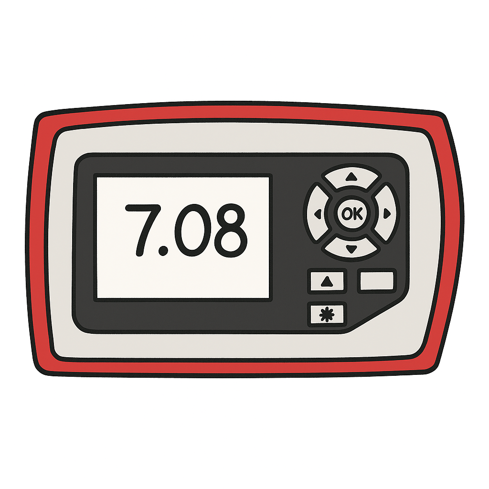
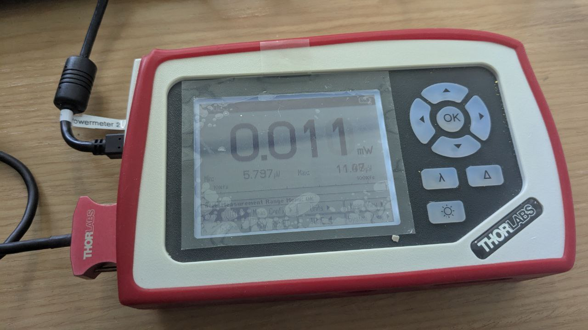
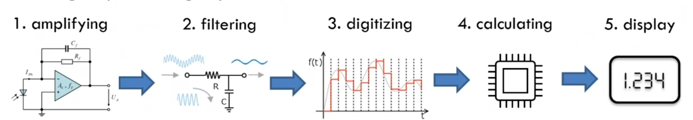
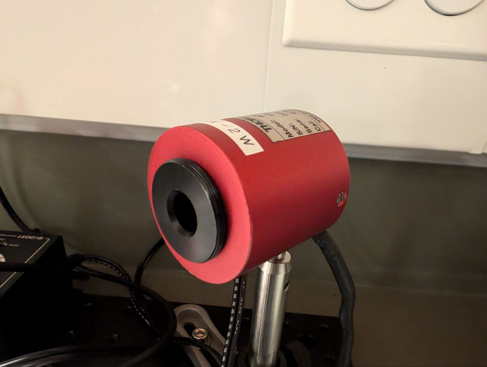
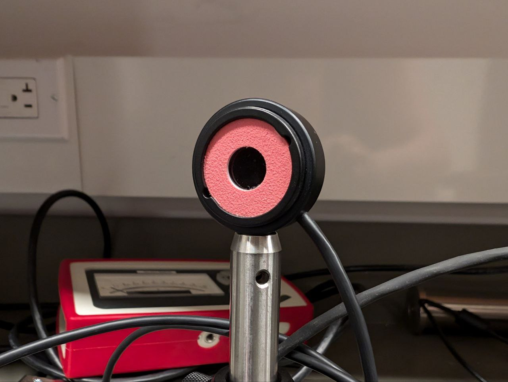
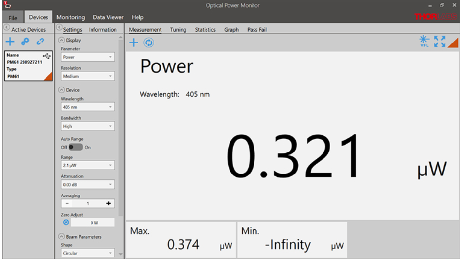

# Power Meters

{ align=left width="20%" }

## Overview


[Optical power meters](https://en.wikipedia.org/wiki/Optical_power_meter) are devices that measure that power of the incident light. (Image on the left was created with chatGPT.)

There are several optical power meters you can use in your experiments: they have different designs and can be attached to different sensors. Here, we will take a look at the Thorlabs: [PM100D](https://www.thorlabs.com/newgrouppage9.cfm?objectgroup_id=3341) power meter or the [PM100A](https://www.thorlabs.com/thorproduct.cfm?partnumber=PM100A).

## Thorlabs: PM100

The PM100 handheld optical power and energy meter is designed to measure the optical power of laser light or other monochromatic or near monochromatic light sources and the energy of pulsed light sources.

{ align=left width="100%" }

### How does it work?

A sensor is attached to the power meter in order to produce an electric current from the incident light, i.e., a sensor is used to somehow convert photons into electrons. Then, this signal goes into the power meter, where it is amplyfied, filtered, digitalized, and used to calculate the power of the incident light. Depending on the process used to create the electrical current, the calculations will be different. Finally, the power is displayed in the screen of the power meter or in your computer. 

{ align=left width="100%" }

There are different types of sensors you can use. Two examples are:

- Photodiode sensors: these sensors rely on the usage of semiconductores in a PIN junction to produce electrons after absorbing photons, see [photoelectric](https://en.wikipedia.org/wiki/Photoelectric_effect) and [photovoltaic effect](https://en.wikipedia.org/wiki/Photovoltaic_effect) for more information. The power of the incident light is proportional to the electric current generated and inversely dependent on the photodiode responsivity, that depends on the wavelength of the incident light. That is why it is important to provide the wavelength to the power meter.

- Thermal sensors: these sensors rely on the usage of dissimilar metals (thermocouples) to create a temperature gradient after absorbing photons. The temperature gradient is then responsible for charge carriers to flow from the warmer to the colder side, see [Thermoelectric effect](https://en.wikipedia.org/wiki/Thermoelectric_effect) and Seebeck effect for more information. The power of the incident light is proportional to the voltage generated and inversely proportional to the sensitivity of the detector, which depends on the absorption coefficient of the coating layer. Higher absorption coefficients, lead to more heat and higher generated voltages. 

Different types of sensors will work better for different light sources, wavelengths and power of the incident light. For example, Photodiode sensors are designed for power measurements of monochromatic or near-monochromatic sources, as they have a wavelength dependent responsivity, while thermal sensors are suitable for power measurements of broadband sources such as [LED](https://en.wikipedia.org/wiki/Light-emitting_diode)s and [SLD](https://en.wikipedia.org/wiki/Superluminescent_diode)s.

Here is a picture of a thermal sensor:

{ align=left width="100%" }

and one of a photodiode sensor:

{ align=left width="100%" }


Another important part of the explanation of how the power meter works is the calibration. Device calibration consists of verifying the measurement accuracy of a device and adjusting for any measurement error. For power meters, there are special setups that use references to ensure that the sensitivity or responsivity of the sensor is correctly determined, which allows to calculate the power of the incident light based on the electrical current produced by the sensor.


To complement this explanation, take a look at these videos: [video1](https://www.youtube.com/watch?v=kbrNnM1ZO-s),[video2](https://www.youtube.com/watch?v=dJ5z-tCRPRM).

### Company software and manual

For the PM100D power meter, Thorlabs provides an [PM100D](https://www.thorlabs.com/drawings/2a9e0a216f4ad295-98027EAF-C9FC-B76D-D47EAC7F4B6AD30D/PM100D-Manual.pdf) and an [optical power monitor](https://www.thorlabs.com/software/MUC/OPM/v6.0/TL_OPM_V6.0.pdf) operation manuals. Check them out when you have time. These material are very important, because they provide you with useful information, such as capabilities and constrains of the device:

{ align=left width="100%" }

The software looks like this:

{ align=left width="100%" }

### How to connect with python?

A quick google search will show you the [ThorlabsPM100 ](https://pypi.org/project/ThorlabsPM100/) python package.

Once again, there are 3 important methods we must implement: 

- Find the device.
- Connect to the device.
- Perform the task. In this case, read the power displayed in the power meter.

#### Find the device

In this example, we are going to use PyVISA for the communication between the device and our computer.

```py
import pyvisa
from ThorlabsPM100 import ThorlabsPM100
import numpy as np


class Powermeter():

    def __init__(self):
        """
        A general powermeter interface.
        """

        # self.rm = pyvisa.ResourceManager('@py')
        self.rm = pyvisa.ResourceManager()
        self.powermeters = {}

    def find_powermeter(self):
        """Find all available ports with Power Meter: PM100 attached."""
        for addr in self.rm.list_resources():
            try:
                name = self.rm.open_resource(addr).query('*IDN?')
                if 'PM100' in name:
                    self.powermeters[name] = addr
            except:
                pass
        return list(self.powermeters.keys())
```

The process is similar to the one we use to check the USB ports with Pyserial used in the Linear stage section. We get a list of possible ports with **list_resources()** from the **pyvisa.ResourceManager()** and we perform a query to look for the identifier of the device that we called **name**. Then we just confirm that the device in question is the **PM100** power meter.


#### Connect to the device

Now we need to connect to one of the ports found.

``` py
import pyvisa
from ThorlabsPM100 import ThorlabsPM100
import numpy as np


class Powermeter():

    def __init__(self):
        """
        A general powermeter interface.
        """

        # self.rm = pyvisa.ResourceManager('@py')
        self.rm = pyvisa.ResourceManager()
        self.powermeters = {}
        self.inst = None
        self.powermeter = None
        self.parameters = {"wavelength": None,
                           "background": 0,
                           "unit": None}

        self._str_wavelength = 'sense:corr:wav'
        self._str_power = 'power:dc:unit '

    def find_powermeter(self):
        """Find all available ports with Power Meter: PM100 attached."""
        for addr in self.rm.list_resources():
            try:
                name = self.rm.open_resource(addr).query('*IDN?')
                if 'PM100' in name:
                    self.powermeters[name] = addr
            except:
                pass
        return list(self.powermeters.keys())


    def connect(self, idn):
        """ Connects to the power meter attached to port idn 
            idn example: list(self.powermeters.keys())[0] 
        """ 
        self.inst = self.rm.open_resource(self.powermeters[idn])
        self.inst.read_termination = '\n'
        self.inst.write_termination = '\r\n'
        self.powermeter = ThorlabsPM100(inst=self.inst)
        self.powermeter.configure.scalar.power()

        self.get_wavelength()
        self.get_unit()

        print('Connected to powermeter: {}'.format(idn))

    def get_wavelength(self):
        """ Retrieve the wavelength selected in the power meter """
        wl = self.inst.query(self._str_wavelength+'?')
        self.parameters["wavelength"] = wl
        print('Wavelength: {} {}'.format(wl, "nm"))
        return wl

    def get_unit(self):
        """ Retrieve the units selected in the power meter """
        u = self.powermeter.sense.power.dc.unit
        self.parameters["unit"] = u     
        return u 
```

Here, **open_resource** returns an instrument (class in Pyvisa) for the resource name provided. Then we provide information for read and write of the device, and finally we connect to the power meter using the **ThorlabsPM100** class. The next line (**self.powermeter.configure.scalar.power()**) is to configure the device to measure power. And then, we confirm the wavelength and the units that the power meter is currently using.


We also added methods to get the wavelength and the units that the power meter is currently using. Note: The wavelength is used in the conversion from optical power to photocurrent for a photodiode sensor. Remember that the photodiode responsivity depends on the wavelength. 

#### Perform the task

For the power meter, the task is to read or measure a value:

``` py
import pyvisa
from ThorlabsPM100 import ThorlabsPM100
import numpy as np


class Powermeter():

    def __init__(self):
        """
        A general powermeter interface.
        """

        # self.rm = pyvisa.ResourceManager('@py')
        self.rm = pyvisa.ResourceManager()
        self.powermeters = {}
        self.inst = None
        self.powermeter = None
        self.parameters = {"wavelength": None,
                           "background": 0,
                           "unit": None}
        self.lastAcq = None
        self.trace = np.zeros(100)
        self._str_wavelength = 'sense:corr:wav'
        self._str_power = 'power:dc:unit '

    def find_powermeter(self):
        """Find all available ports with Power Meter: PM100 attached."""
        for addr in self.rm.list_resources():
            try:
                name = self.rm.open_resource(addr).query('*IDN?')
                if 'PM100' in name:
                    self.powermeters[name] = addr
            except:
                pass
        return list(self.powermeters.keys())


    def connect(self, idn):
        """ Connects to the power meter attached to port idn """
        # idn example: list(self.powermeters.keys())[0]  
        self.inst = self.rm.open_resource(self.powermeters[idn])
        self.inst.read_termination = '\n'
        self.inst.write_termination = '\r\n'
        self.powermeter = ThorlabsPM100(inst=self.inst)
        self.powermeter.configure.scalar.power()

        self.get_wavelength()
        self.get_unit()

        print('Connected to powermeter: {}'.format(idn))

    def get_wavelength(self):
        """ Retrieve the wavelength selected in the power meter """
        wl = self.inst.query(self._str_wavelength+'?')
        self.parameters["wavelength"] = wl
        print('Wavelength: {} {}'.format(wl, "nm"))
        return wl

    def get_unit(self):
        """ Retrieve the units selected in the power meter """
        u = self.powermeter.sense.power.dc.unit
        self.parameters["unit"] = u     
        return u 

    def read(self, printval=False):
        """ reads the power displayed in the power meter """
        val = self.powermeter.read
        self.lastAcq = val
        self.trace = np.append(self.trace[1:], val)
        if printval:
            print('Measure: {} {}'.format(val, self.parameters["unit"]))
        return val
```

Here, we are using the **read** method from the ThorlabsPM100 class and returning the value measured **val**. We are also saving it in a list and as the last acquired value, you will use these variables tomorrow.

#### Additional methods:
It might be convenient to define methods to change or set units and to set wavelengths:

``` py
    """ This methods should be included in the PowerMeter class"""

    def set_wavelength(self, wl):
        """ Sets wl as the wavelength in the Power Meter"""
        self.inst.write(self._str_wavelength+' '+str(int(wl)))
        return self.get_wavelength()

    def set_unit(self, unit):
        """ Sets units to W or dBm"""
        if unit not in ['W', 'dBm']:
            print("Unit must be W or dBm")
        else:
            self.inst.write(self._str_power+unit)
        return self.get_unit()

    def switch_unit(self):
        """ Switches between the units"""
        if self.parameters["unit"] == 'W':
            self.inst.write(self._str_power+'dBm')
        else:
            self.inst.write(self._str_power+'W')
        return self.get_unit()    
```
 
### Exercise
Create a **get_background** method that will read the background and add it to the class parameters. Then change the **read** method in order to be able to make normal measurements and measurements where you subtract the background. 

{ align=center width="100%"}

Here is the solution:

``` py
""" This methods should be included in the PowerMeter class"""

    def read(self, pure=False, printval=False):
        if pure:
            val = self.powermeter.read
        else:
            val = self.powermeter.read - self.parameters["background"]
        self.lastAcq = val
        self.trace = np.append(self.trace[1:], val)
        if printval:
            print('Measure: {} {}'.format(val, self.parameters["unit"]))
        return val

    def get_background(self):
        self.parameters["background"] = self.read(pure=True)
        self.read()
        print('Background: {} {}'.format(self.parameters["background"], self.parameters["unit"]))
```

