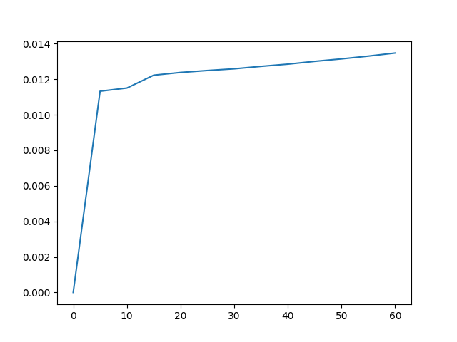
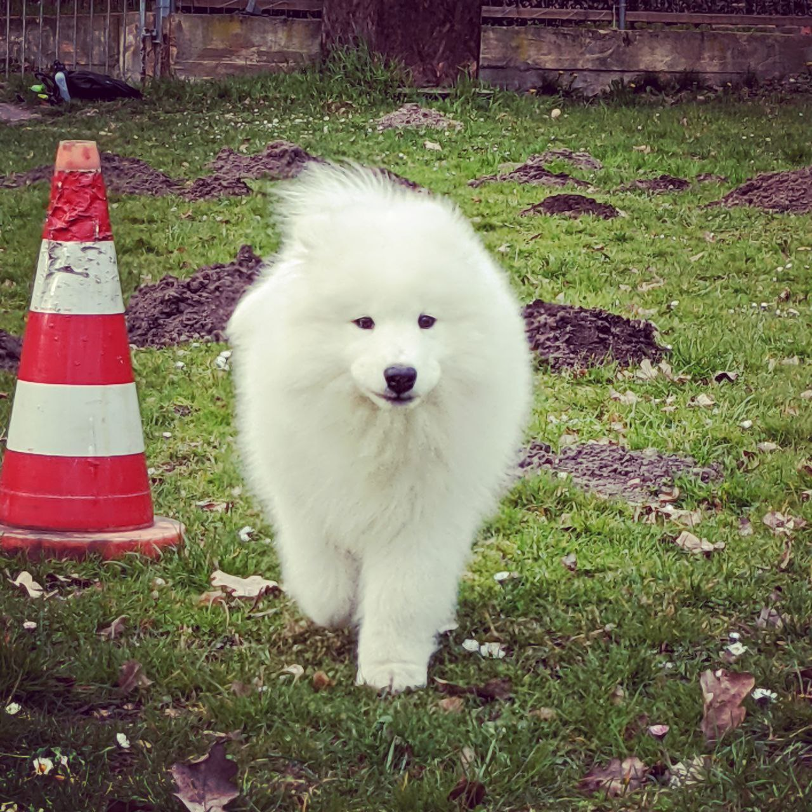
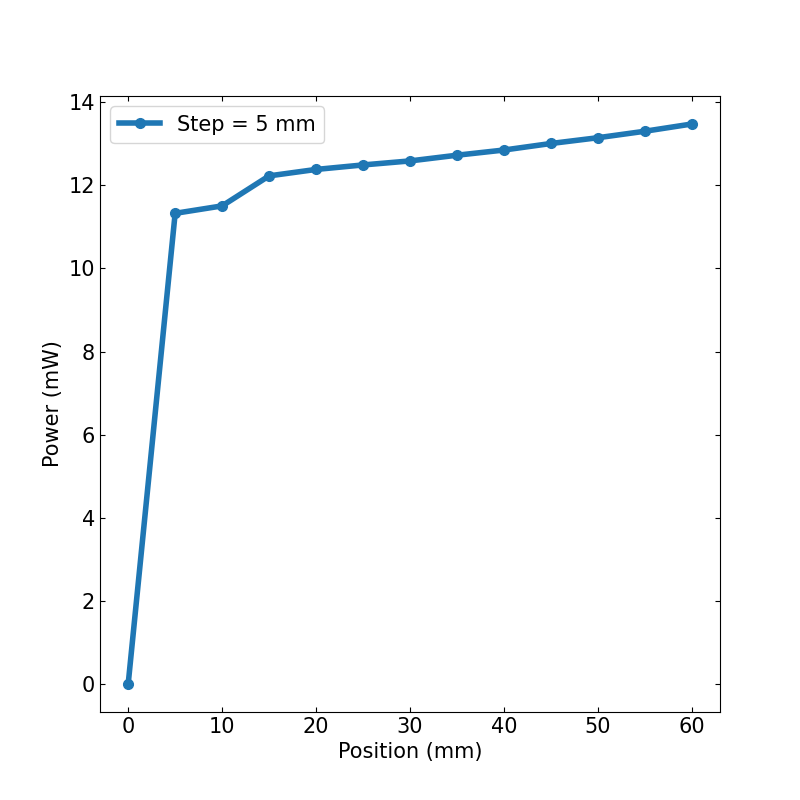

# How to save and plot data?

{ align=left width="20%" }


## Jog and measure
(Image on the left was created with chatGPT.)
In the exercise from linear the linear stage section, you wrote this method for our LinearStage class:

``` py
import time

def jog_and_measure(self, start=0, end=60, step=1, 
                    function=time.time, wait_time=1):
    
    for pos in range(start, end+1, step):
        position = self.move(pos)
        measure = function()
        print(position, measure)
        time.sleep(wait_time=1)
    return 0

```

This works! But we might want to do more operations on the lists of measurements and positions. Also depending on your experiment, you might want to save the positions and measurements at the end, as the code will be more efficient, unless we encounter memory problems, or you might want to save the entire lists at each iteration. In this manner, you will have all the necessary information in case your program crashes.


``` py
import time

def move(pos):
    return float(pos)

def jog_and_measure(start=0, end=60, step=1, function=time.time):
    
    position, measure = [], []
    for pos in range(start, end+1, step):
        position.append(move(pos))
        measure.append(function())
        print(position, measure)
        time.sleep(wait_time=1)
    # print(position, measure)
    return 0

jog_and_measure(start=0, end=60, step=5, function=time.time)
```

Looks good. Here, we also added a move function and rewrote the class method as a function so that we can use it to explain how to save data without needing to connect to the linear stage.

Now, let us also remove  **time.time** from the function definition, it can actually cause problems. And add parameters that we want to save, such as the step size, here called just step. And because we want to discuss more ways to save data, let us add a function to save data.

``` py
import time

def move(pos):
    return float(pos)

def my_save_data(**kwargs):
    print(kwargs)

def jog_and_measure(start=0, end=60, step=1, function=None):
    
    if not function:
        print("Need funcion")
        return 1
    
    position, measure = [], []
    for pos in range(start, end+1, step):
        position.append(move(pos))
        measure.append(function())
        time.sleep(wait_time=1)
        my_save_data(position=position, measure=measure, step=step)
    return 0

jog_and_measure(start=0, end=60, step=5, function=time.time)
```

Here, we are actually printing a python dictionary, when we print **kwargs**. This keyword is a special symbol used for passing keyword arguments in Python. You can read more about it here.


## Save data


As we saw, the easiest way to save data in python is to just print it. However, you might not like the formating. Here we show a way to improve this formatting:

``` py
def with_print_fancy(**kwargs):
    
    print_as_list = []
    for key, val in kwargs.items():
        if not isinstance(val, list):
            print("#", "%s: %s" % (key, val))
        else:
            print_as_list.append(key)
                
    print("#", *print_as_list)
    for row in zip(*(kwargs[i] for i in print_as_list)):
        print(*row)
```
You can add this function to your program and call it with:

``` py
with_print_fancy(position=position, measure=measure, step=step)
```

This will provide a nicer output, but it looks a bit complicated... It is easier to just add the parameters to the arguments of the function:

``` py
def with_print(parameters={}, **kwargs):
    
    for key, val in parameters.items():
        print("#", "%s: %s" % (key, val))
    print("#", *kwargs.keys())
    for row in zip(*kwargs.values()):
        print(*row)
```

You can add this function to your program and call it with:

``` py
with_print(position=position, measure=measure, parameters={"step":step})
```

This will provide a nicer output. To write files you can simply redirect the output of print to a file:

``` py
def to_file(filename = "out", parameters={}, **kwargs):
    
    filename = filename + ".txt"
    with open(filename, "w") as f:
        for key, val in parameters.items():
            print("#", "%s: %s" % (key, val), file=f)
        print("#", *kwargs.keys(), file=f)
        for row in zip(*kwargs.values()):
            print(*row, file=f)
```

But honestly, this is a waste of time! There are better ways to write files. When programming you should always remember: "Don't reinvent the wheel!" and "There is a good chance that someone already solved this small problem before" (note: when programming you should always try to brake your problem into smaller parts).

Better ways are usually found inside certain python packages. These also allow you to save the data in formats that you can then use with other programs, such as matlab or excell. Here we will recommend the modules numpy and json. 

``` py
def with_json(filename = "out", **kwargs):
    import json
    
    filename = filename + ".json"
    
    with open(filename, "w") as f:
        json.dump(kwargs, f)
```

See? This is short and easy!

``` py
def with_numpy(filename = "out", parameters={}, **kwargs):
    import numpy as np
    
    filename = filename + ".txt"
    header = ""
    for key, val in parameters.items():
        header += "{}: {} \n".format(key, val)
    header += " ".join(kwargs.keys())
    
    np.savetxt(filename, np.c_[ *kwargs.values() ], header=header)
```

Here is a complete example:

``` py
import time
import datetime
import save_data

def move(pos):
    return float(pos)

def jog_and_measure(start=0, end=60, step=1, function=None):
    
    if not function:
        print("Need funcion")
        return 1
    
    position, measure = [], []
    filename = "out_"+str(datetime.datetime.now()).replace('.','_').replace(' ', '_').replace(':', '_')
    for pos in range(start, end+1, step):
        position.append(move(pos))
        measure.append(function())

        save_data.with_json(filename= filename, position=position, measure=measure, step=step)
    return 0

jog_and_measure(start=0, end=60, step=5, function=time.time)
```
Here, we use **datetime** to provide a timestamp that we include in filename. We do not create a new file, with new filename at every iteration of the loop though, we rewrite the json file at every iteration, which is less efficient but extremely useful if the computer crashes.

## Plot data

You will now need to load the data from the files and then plot the data. To load the data we still recommend numpy and json, but another powerful module to process data is pandas.

For plotting, we will simply show you [matplotlib](https://matplotlib.org/), but there are others modules, such as [plotly](https://plotly.com/python/) or [seaborn](https://seaborn.pydata.org/).

``` py
import json
import numpy as np
import glob
import matplotlib.pyplot as plt

filenames = glob.glob("out*json")
print(filenames)

with open(filenames[-1], "r") as f:
    data = json.load(f)
    
print(data.keys())
y = np.array(data["measure"])
factor = y[0]
y = y - factor

plt.plot(data["position"], y)
# plt.show()
plt.savefig("my_plot_{}.png".format(data["step"]))
```
Which will result in:

{ align=center width="100%"}


## Exercise

Make the plot more beautiful, add legend and axis labels.
{ align=center width="100%"}


``` py
import json
import numpy as np
import glob
import matplotlib.pyplot as plt

filenames = glob.glob("out*json")
print(filenames)

with open(filenames[-1], "r") as f:
    data = json.load(f)
    
print(data.keys())
y = np.array(data["measure"])
factor = y[0]
y = (y - factor)*1000

plt.rcParams.update({'font.size': 15})
fig, ax = plt.subplots(figsize=(8,8))
ax.plot(data["position"], y,
        linewidth=4, marker="o", markersize=7,
        label="Step = {} mm".format(data["step"]))
ax.legend()
ax.set_xlabel("Position (mm)")
ax.set_ylabel("Power (mW)")
ax.tick_params(axis='both', direction='in', top=True, right=True)

plt.savefig("my_pretty_plot_{}.png".format(data["step"]))
```

There are more things you can change to make the plot more beautiful. You can change colors, font sizes, add other parameters or symbols... If you have **Latex** installed, you can easily use fonts and symbols from **Latex**.

Here is the plot from the solution above:

{ align=center width="100%"}